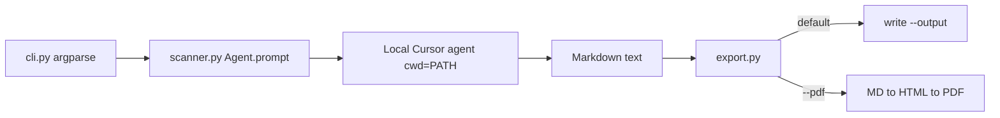

I've shared a few posts recently talking about how I'm using Cursor to learn and employ agentic development. Primarily that work has all been done via our Agent view, but this is just one of the surfaces you can use with the platform. I had a chance recently to try out the SDK and I thought I'd share a little demo I built with it. 

First - some explanation would be helpful. You can use Cursor with the desktop application, on the web, via CLI, on iOS, even via API. But the SDK lets you use the platform from your code. There's an SDK for [TypeScript](https://cursor.com/docs/sdk/typescript), [Python](https://cursor.com/docs/sdk/python), and a [bridge](https://cursor.com/docs/sdk/bridge) that embeds a TypeScript server and lets you use any language. Honestly I've never seen that before in a platform and it's pretty freaking cool. (And... just to remind folks, I do work at Cursor so I'm biased, but that's absolutely an honest opinion.)

With the SDK, you can do all the things you can usually do with the platform - run prompts in different modes - swap models at will, including the auto router which makes it easier, even kick off agents that run in the cloud. Definitely check the [docs](https://cursor.com/docs/sdk/python) for a full detailed list of what you can do, but it's basically the platform itself - in your code. 

I built a quick demo with the TypeScript SDK, but then switched over to Python as I felt it a bit easier for me to use. The [quickstart](https://cursor.com/docs/sdk/python#quick-start) shows how easy it is:

```python
import os

from cursor_sdk import Agent, LocalAgentOptions

with Agent.create(
    model="composer-2.5",
    api_key="crsr_key",
    local=LocalAgentOptions(cwd=os.getcwd()),
) as agent:
    print(agent.send("Summarize what this repository does").text())
```

This returns the final result of the prompt, but you also have the ability to get *everything* that was generated, so for example, the detailed list of tool calls and such. You can also decide between streaming or just waiting and getting the final result.

All of this just works - which is what you want in a SDK - and the quick start example is one of my favorite things to do with Cursor - basically "what the heck is this repo/set of code doing" - and I thought it would be cool to turn this into a CLI tool. 

To be clear, normally I'd use the Cursor Agent window, open the repo or folder, and use Ask mode to describe the project. But if I'm not planning to work with the code later and just want a good explanation, a CLI tool could be useful for this purpose instead. 

Of course, the easiest way to build this is to use Cursor itself. I set up a new folder and started a new plan:

```
/plan create a Python CLI that makes use of the Cursor SDK. The CLI is a 
tool that will scan a code base and generated a detailed report of the 
application/code base of the folder being scanned. What it does, what 
technologies it use, what frameworks are in place, and so forth.

The CLI should support a help command. 
The CLI will scan the current directory by default, but supports an 
argument to specify a path.
The CLI will output Markdown, but an argument allows for a PDF file output.
Require a filename to store the result. 
```

This created the following plan:


---
name: Python SDK CLI
overview: Build a greenfield Python CLI (`codebase-report`) that uses the Cursor Python SDK’s local agent to analyze a target directory and write a structured Markdown or PDF report to a required output filename.
todos:
  - id: scaffold
    content: Create pyproject.toml, package layout, README with install/auth/usage
    status: completed
  - id: cli
    content: "Implement argparse CLI: required --output, optional PATH, --pdf, --help"
    status: completed
  - id: scanner
    content: Implement Agent.prompt local scan with structured Markdown prompt and exit codes
    status: completed
  - id: export
    content: Implement Markdown write and Markdown-to-PDF via markdown + xhtml2pdf
    status: completed
isProject: false
---

# Python CLI: Codebase Report via Cursor SDK

## Goal

Ship an installable Python CLI that points a **local** Cursor agent at a folder, asks it to produce a detailed codebase report, and writes the result to a required output file as **Markdown** (default) or **PDF** (`--pdf`).

## CLI interface

Console script: `codebase-report`

```text
codebase-report --output REPORT.md [PATH]
codebase-report --pdf --output REPORT.pdf [PATH]
codebase-report --help
```


| Arg               | Behavior                                                       |
| ----------------- | -------------------------------------------------------------- |
| `PATH`            | Optional; defaults to current working directory (`.`)          |
| `-o` / `--output` | **Required** filename/path for the report                      |
| `--pdf`           | Convert agent Markdown to PDF and write that instead of `.md`  |
| `-h` / `--help`   | Standard argparse help (covers the “help command” requirement) |


Validation: `PATH` must exist and be a directory; refuse missing `--output`; exit non-zero on SDK startup vs run failures (see below).

## Architecture




**Runtime choice:** local agent with `LocalAgentOptions(cwd=resolved_path)`. The agent reads the tree on disk; no cloud clone needed.

**Invocation pattern:** one-shot `Agent.prompt(...)` (create → run → dispose). No multi-turn, no streaming required for v1; optionally print a short “Scanning…” status to stderr.

**Auth:** `CURSOR_API_KEY` from the environment (documented in README). Pass `api_key=os.environ["CURSOR_API_KEY"]` explicitly so a missing key fails clearly.

**Model:** `composer-2.5`.

## Project layout (greenfield)

```text
pyproject.toml          # package + console_scripts entry
README.md               # install, CURSOR_API_KEY, usage examples
src/codebase_report/
  __init__.py
  __main__.py           # python -m codebase_report
  cli.py                # argparse + main()
  scanner.py            # Agent.prompt + prompt text + error handling
  export.py             # write markdown / pdf
```

Dependencies in `pyproject.toml`:

- `cursor-sdk` (Python ≥3.10)
- `markdown` + `xhtml2pdf` for PDF (pure pip; no system WeasyPrint/Pandoc)

## Core implementation details

### Prompt (`scanner.py`)

Instruct the agent to **explore the codebase** (read manifests, configs, source layout) and return **only Markdown** covering at least:

- Overview / purpose
- Primary languages and runtimes
- Frameworks and major libraries
- Architecture / top-level structure
- Entry points and how to run/build/test (if discoverable)
- Notable tooling (CI, linters, package managers)
- Anything else material about the app

Also instruct: do not modify files; do not wrap the whole answer in a single fenced code block. The CLI owns writing the output file from `result.result` (or equivalent final text).

### Agent call

```python
from cursor_sdk import Agent, AgentOptions, LocalAgentOptions, CursorAgentError

result = Agent.prompt(
    PROMPT,
    AgentOptions(
        api_key=os.environ["CURSOR_API_KEY"],
        model="composer-2.5",
        local=LocalAgentOptions(cwd=str(scan_path.resolve())),
    ),
)
```

Error handling per SDK guidance:

- `CursorAgentError` → stderr + exit `1` (auth/config/network; never started)
- `result.status == "error"` → stderr + exit `2` (run failed)
- success → extract Markdown text, then export

### Export (`export.py`)

- **Markdown:** write UTF-8 text to `--output`
- **PDF:** `markdown.markdown(...)` → HTML → `xhtml2pdf` → write bytes to `--output`

Light post-process: if the agent returns a single outer ````markdown ... ```` fence, strip it before writing.

## README (minimal)

- `pip install -e .`
- `export CURSOR_API_KEY=...`
- Example scans of `.` and an explicit path, Markdown and PDF

## Out of scope for v1

- Cloud agents, resume, streaming UI, interactive REPL
- Config files / model override flags
- Uploading or publishing the report



By the way, the Architecture was a pretty Mermaid chart that's not rendering on my blog:

<p>

</p>

The end result - in terminal I can create a report in either Markdown or PDF. I'll share a link to the entire thing below, but let's take a look at the Python file responsible for analyzing the codebase via the Cursor SDK:

```python
"""Run a local Cursor agent to produce a codebase Markdown report."""

from __future__ import annotations

import os
import sys
from pathlib import Path

from cursor_sdk import Agent, AgentOptions, CursorAgentError, LocalAgentOptions

PROMPT = """\
Explore this codebase thoroughly (manifests, configs, source layout, docs) and \
produce a detailed report about the application.

Cover at least:
- Overview / purpose of the project
- Primary languages and runtimes
- Frameworks and major libraries
- Architecture and top-level structure
- Entry points and how to run, build, and test (if discoverable)
- Notable tooling (CI, linters, package managers, etc.)
- Anything else material about how the app works

Rules:
- Do not modify, create, or delete any files.
- Return ONLY Markdown for the report (headings, lists, short code snippets as needed).
- Do not wrap the entire reply in a single fenced code block.
"""


class ScanError(Exception):
    """CLI-facing scan failure with an exit code."""

    def __init__(self, message: str, exit_code: int) -> None:
        super().__init__(message)
        self.exit_code = exit_code


def _require_api_key() -> str:
    api_key = os.environ.get("CURSOR_API_KEY", "").strip()
    if not api_key:
        raise ScanError(
            "CURSOR_API_KEY is not set. Export it before running codebase-report.",
            exit_code=1,
        )
    return api_key


def _extract_markdown(result: object) -> str:
    text = getattr(result, "result", None)
    if isinstance(text, str) and text.strip():
        return text
    raise ScanError("Agent finished but returned no report text.", exit_code=2)


def scan_codebase(scan_path: Path) -> str:
    """Analyze *scan_path* with a local Cursor agent and return Markdown."""
    api_key = _require_api_key()
    cwd = str(scan_path.resolve())

    print(f"Scanning {cwd} with Cursor agent…", file=sys.stderr)

    try:
        result = Agent.prompt(
            PROMPT,
            AgentOptions(
                api_key=api_key,
                model="composer-2.5",
                local=LocalAgentOptions(cwd=cwd),
            ),
        )
    except CursorAgentError as err:
        retryable = getattr(err, "is_retryable", False)
        raise ScanError(
            f"startup failed: {err.message} (retryable={retryable})",
            exit_code=1,
        ) from err

    status = getattr(result, "status", None)
    if status == "error":
        run_id = getattr(result, "id", "unknown")
        raise ScanError(f"run failed: {run_id}", exit_code=2)

    return _extract_markdown(result)
```

This is pretty robust and the prompt it uses is really well written. (Ok, as a reminder folks, don't forget prompt writing is still important *and* you can cheat at that by asking your AI agent to improve your prompt before you actually run it.) 

I did a quick run of this on my blog and got the following:

<iframe src="https://static.raymondcamden.com/images/2026/08/foo.pdf" width="100%" height="500"></iframe>

This is a rather simple example, but being able to use the Cursor platform in code like this could be really freaking powerful I think. If you've done something like this, I'd love to hear more, share a comment below. You can check out the full code here: <https://github.com/cfjedimaster/cursor_python_sdk_cli_demo>